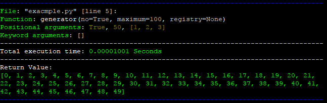
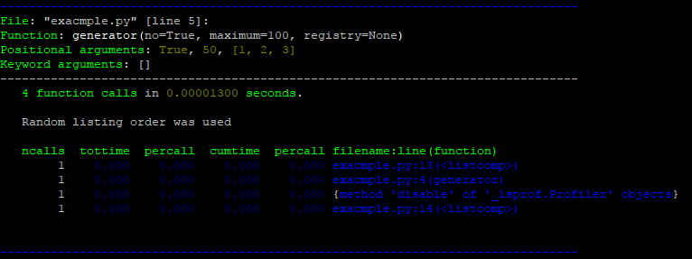

<a href="https://github.com/lk-geimfari/slippery/">
    <p align="center">
      
    </p>
</a>


**Slippery** - collections of useful decorators for different phases of development software. 
Your code seems works slowly and you have not any idea why it's happen and how to check it? Function returns crazily structured data and you can't find what you need? So, Slippery Stair help with all this problems and another ones. Just decorate function which you need and take a look at result.

## Installation

```
➜  pip install slippery
```

## Usage

For using this library you need to pay 25 schmeckles.

```bash
export SCHMECKLES=25
```

Actually you can use it without paying schmeckles, but... come on! 25 schmeckles for Slippery Stair? Easily!


## Now, seriously

Sometime we need to check out execution time of some function. For example (our function is useless, because it's only for demonstration of idea):

```python
import slippery

@slippery.execution_time
def generator(no=True, maximum=100, registry=None):
    if True:
        do_something()

    if not registry:
        update_something()

    result = [
        k for k in [
            i for i in range(maximum)
        ]
    ]

    return result
    
if __name__ == '__main__':
    generator(True, 100, [1, 2, 3])
```
Result:




When you need more information than returns `@execution_time` decorator, then you should use decorator `@efficiency`:

```python
@slippery.efficiency
def generator(*args, **kwargs):
    # ...

```

Result:




Also you can disassemble function using decorator `@disassemble`:

```python
@slippery.disassemble
def generator(maximum=1000):
    result = [
        k for k in [
            i for i in range(20)
        ]
    ]
    result.append([x for x in 'SMAP'])

    return result	
```
Result:


## Disclaimer
Slippery is developed only for developers and only for debugging and testing phases. This library should not used in production, if you don't want unacceptable behaviour of your application.

## Thanks

This library is originally inspired by character (*Slippery Stair*) from `Rick and Morty`. Special thanks for `Mark Lutz` and `Luciano Romalho` for great books about Python.
