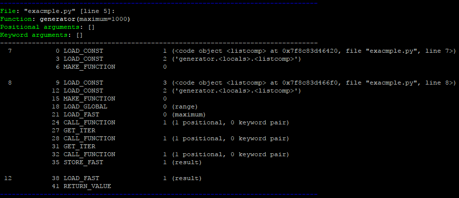

<a href="https://github.com/lk-geimfari/slippery/">
    <p align="center">
      
    </p>
</a>


**Slippery** - collections of useful decorators for different phases of 
software development. 

Your code seems to work slowly and you haven't got any idea why it happens 
and how to solve it? 

A function returns crazily structured data and you can't find what you need? 

So, Slippery Stair help with all these problems and some more. 
Just decorate functions you need to take a second look at and see what happens!

## Installation

```
➜  pip install slippery
```

## Usage

To use this library you need to pay 25 schmeckles.

```bash
export SCHMECKLES=25
```

<sub>You can actually use it without paying any schmeckles, but... come on! 
Only 25 schmeckles for Slippery Stair? That's a bargain!


## Now, seriously

Sometime we need to check out execution time of some function. 
Here's a useless function for example:

```python
import slippery

@slippery.execution_time
def generator(no=True, maximum=100, registry=None):
    if no:
        do_something()

    if not registry:
        update_something()

    result = [
        k for k in [
            i for i in range(maximum)
        ]
    ]

    return result
    
if __name__ == '__main__':
    generator(True, 100, [1, 2, 3])
```
Result:


When you need more information than the one returned from the `@execution_time` decorator you should use the `@efficiency` decorator:

```python
@slippery.efficiency
def generator(*args, **kwargs):
    # ...

```

Result:


You can also disassemble the function using the `@disassemble` decorator:

```python
@slippery.disassemble
def generator(maximum=1000):
    result = [
        k for k in [
            i for i in range(20)
        ]
    ]
    result.append([x for x in 'SMAP'])

    return result	
```
Result:




## Disclaimer
Slippery is developed only for developers and only for debugging and testing phases. This library should not used in production, if you don't want unacceptable behaviour of your application.

## Thanks

This library is originally inspired by the character *Slippery Stair* from `Rick and Morty`. Special thanks for `Mark Lutz` and `Luciano Romalho` for great books about Python.
